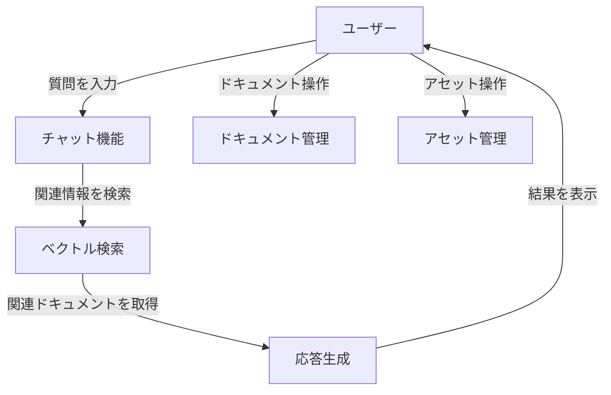
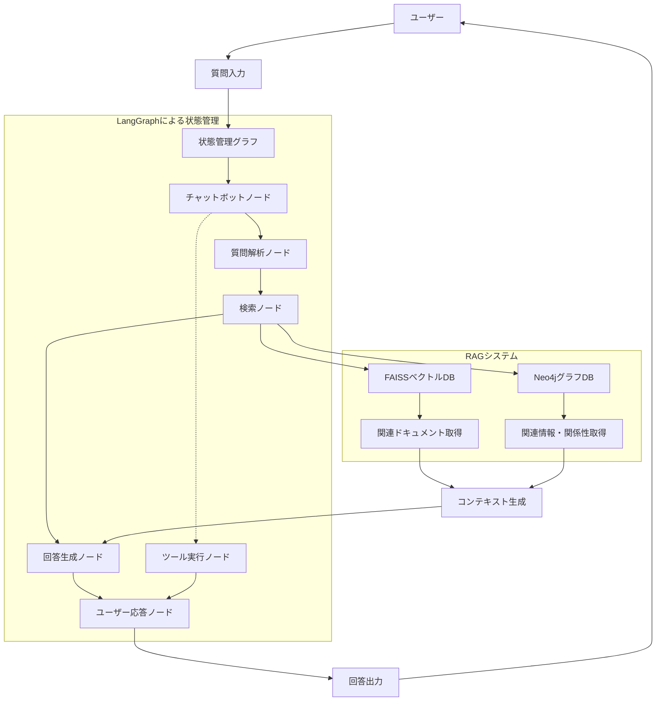

# Knowledge RAGシステム

**Knowledge RAG**システムは、ドキュメント管理とチャットベースのインタラクションを提供するWebアプリケーションです。本READMEでは、システムの機能や仕組みについて詳細に説明します。

---

## 目次
1. [システム概要](#システム概要)
2. [ファイル構成](#ファイル構成)
3. [機能](#機能)
4. [システムフロー](#システムフロー)
5. [セットアップ手順](#セットアップ手順)
6. [機能的な観点](#機能的な観点)

---

## システム概要

Knowledge RAGシステムは以下の機能を提供します：
- **チャット機能**: 質問に基づいて関連する情報を検索し、応答を生成。
- **ドキュメント管理**: 登録されたドキュメントの種類や詳細を管理。
- **アセット管理**: 登録済みのアセットを一覧表示し、詳細情報を取得。
- **ベクトル検索**: ドキュメントをベクトル化し、効率的な検索を実現。

バックエンドはFlaskを使用して構築されており、OpenAIのAPIやFAISSベクトルデータベースを活用しています。


## 機能

### 1. チャット機能
- 質問を受け取り、関連する情報を検索して応答を生成。
- ベクトル検索を利用して、関連性の高いドキュメントを取得。
- 応答には関連するドキュメントの情報も含まれる。

### 2. ドキュメント管理
- 登録されたドキュメントの種類と詳細を表示。
- ドキュメントのメタデータや内容を確認可能。

### 3. アセット管理
- 登録済みのアセットを一覧表示。
- アセットの詳細情報を取得可能。

### 4. ベクトル検索
- ドキュメントをベクトル化し、効率的な検索を実現。
- 検索結果は関連性の高い順に表示。

---

## システムフロー

以下の図はシステムのフローを示しています：



---

# Knowledge RAGシステムのアーキテクチャ

## 概要

Knowledge RAGシステムは、ベクトル検索とグラフデータベースを組み合わせた高度な質問応答システムです。ユーザーからの質問に対して、関連ドキュメントを検索し、コンテキストを考慮した回答を生成します。システムは主にLangChain、LangGraph、Neo4j、FAISSなどの技術を組み合わせて構築されています。

## システムアーキテクチャ図



## コンポーネントの説明

### 1. 状態管理システム（LangGraph）

システムの中核はLangGraphによる状態管理フレームワークです。各ノードが特定の機能を担当し、状態に応じて遷移します。

- **Node_chatbot**: 初期応答と会話管理を担当
- **Node_human**: ユーザー入力を処理し、会話終了の判定も行う
- **Node_question**: 質問の解析と処理方法の決定
- **Node_retriver**: RAGシステムを使って関連情報を検索
- **Node_answer**: 取得した情報を基に回答を生成
- **Node_tool**: 質問分割や時間取得などの特殊なツールを実行

### 2. RAG（検索拡張生成）システム

#### ベクトル検索（FAISS）
```python
def set_rag_data_with_vector(question, db_path):
    # FAISSベクトルDBの読み込み
    db = FAISS.load_local(db_path, emb, allow_dangerous_deserialization=True)
    
    # 検索機能の設定
    retriever = db.as_retriever(search_kwargs={'k': inf_param_instance.Top_k})
    
    # 質問をRAGで検索し、結果を取得
    context = retriever.get_relevant_documents(question)
    return context
```

- ドキュメントをベクトル化して類似度検索を実行
- 質問に最も関連性の高いドキュメントを`Top_k`件取得
- 検索結果はコンテキストとして回答生成に使用

#### グラフデータベース（Neo4j）
```python
def isert_db(data):
    # ノードとエッジの作成
    node_list = [i["id"] for i in data["nodes"]]
    label_list = [i["text"] for i in data["nodes"]]
    pair_node_info = []
    
    # ノード作成
    with driver.session() as session:
        session.execute_write(add_node, pair_node_info)
        
    # 関係性作成
    relations = [i for i in data["edges"]] 
    with driver.session() as session:
        session.execute_write(add_relation, relations)
```

- 複雑な関係性を保持するグラフデータベース
- エンティティ間の関係を明示的に表現（AUTHOR、STARS、PRODUCEDなど）
- Cypherクエリ言語を使用して関係検索を実行

### 3. 質問応答プロセス

1. **質問入力**:
   - ユーザーから質問を受け取り、必要に応じて`tool_div_query`で分割

2. **情報検索**:
   - ベクトル検索で関連ドキュメントを取得
   - 必要に応じてグラフデータベースで関係性を検索

3. **コンテキスト構築**:
   - 検索結果から質問に関連する情報をコンテキストとして構築
   - ドキュメントのメタデータ（ファイル名、ページ番号など）も記録

4. **回答生成**:
   - プロンプトテンプレートを使用してコンテキストと質問を組み合わせる
   - LLMを使用して最終的な回答を生成
   - プロンプト例: `"次の文脈（context）のみに基づいて質問（question）に答えてください。..."`

### 4. 補助機能

- **ツール統合**:
  - `tool_div_query`: 複数の質問を含むクエリを分割
  - `tool_get_time`: 時間関連の質問に対応

- **ロギング機能**:
  - 質問、検索結果、回答などの情報をログとして記録
  - デバッグおよび改善のためのデータ収集

## データフロー

1. ユーザーが質問を入力
2. チャットボットノードが質問を受け取り、適切な処理を判断
3. 質問ノードが質問を解析
4. 検索ノードが関連ドキュメントとグラフ情報を取得
5. 回答ノードがコンテキストを使用して回答を生成
6. 回答がユーザーに表示される

## まとめ

このシステムは、従来のRAGシステムを拡張し、グラフデータベースを統合することで、単なるキーワードマッチングを超えた関係性を考慮した質問応答が可能になっています。StateGraphによる状態管理により、複雑な会話フローと機能拡張が実現されています。


## 機能的な観点

### 1. チャット機能の仕組み
- 質問を受け取ると、ベクトル検索を使用して関連するドキュメントを取得。
- OpenAIのAPIを使用して、取得したドキュメントを基に応答を生成。

### 2. ドキュメント管理の仕組み
- FAISSベクトルデータベースを使用してドキュメントを管理。
- ドキュメントの種類や詳細を取得するAPIを提供。

### 3. アセット管理の仕組み
- 登録されたアセットを一覧表示し、詳細情報を取得するAPIを提供。

### 4. ベクトル検索の仕組み
- ドキュメントを分割し、埋め込みモデルを使用してベクトル化。
- ベクトルデータベースに保存し、効率的な検索を実現。

---

## フォルダ構成 
```
Knowledge_RAG/
├── backend/
│   ├── common_func.py      # 共通関数モジュール
│   ├── load_doc.py  # 
│   ├── add_tag.py  # 
│   ├── doc_manage.py  # 
│   ├── create_vectordb.py  # ベクターデータベース作成スクリプト
│   ├── create_keyworddb.py # キーワードデータベース作成スクリプト
│   ├── create_graphdb.py # キーワードデータベース作成スクリプト
│   ├── loggings.py         # ログ機能モジュール
│   ├── model_settings.py   # モデル設定モジュール
│   ├── qa_agent.py         # Q&Aエージェント実装
│   ├── prompts/
|   |   ├── assetlabel_check.txt
|   |   └── graphdb_create.txt
│   └──tmp/                # 一時ファイル保存ディレクトリ
├── data/
│   ├── admin/       ・・・ドキュメント管理情報
│   ├── asset_label/ ・・・
│   ├── db/
│   ├── doc/
│   └──  doc_text/
├── config/
│   └── config.ini
├── log/
│   └── log.ini
├── README.md
└── requirements.txt
```